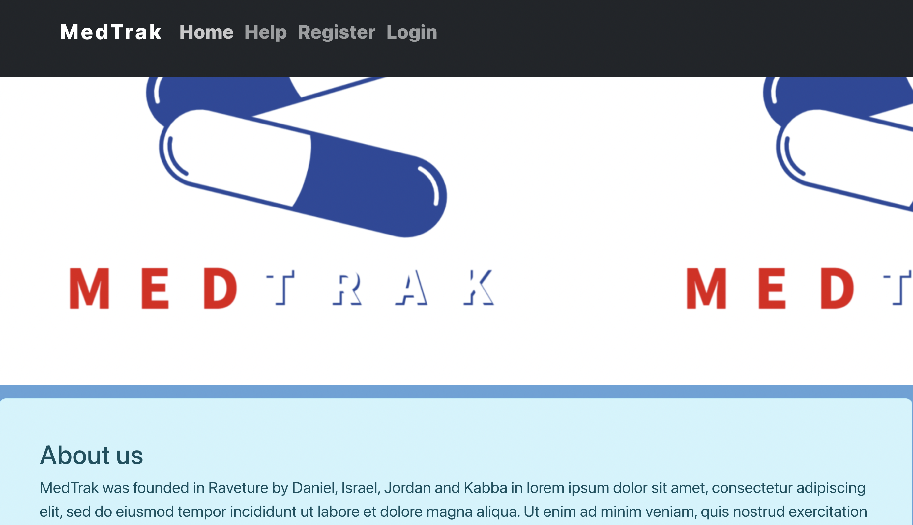

Medications can improve the lives of people who suffer from chronic conditions, such as diabetes, high blood pressure, high cholesterol, cancer, mental illness and chronic pain. However, not taking your medicines as prescribed can be risky.

# As a user on a different medications

This app is developed as your personal pharmacists to help you with your medication intake.
A new user will have the option to create an account.
An existing user will be able to log in with their credentials.
If you are a new user, the aplication will ask you to add you medications (CREATE).
If you are an existing user, you will have the option to view your medications (READ).
If you meds run out, you can add refills or change your medications (UPDATE).
If you are no longer on a medication, you can remove or delete that medicine (DELETE).

I use will be able to look up their medication information by typing the name on the search bar.

User will be presented with drug's safety/adverse event, Routes of administration, Temperature excursion,  Ingredients/excipients and so on..

This app uses FDA API to get prescription drugs data.
This was a group project I contributed to, I was in charge of the frontend.
this is the backend repo https://github.com/220425-Reston-NET/Alpha_Code_P2

  
